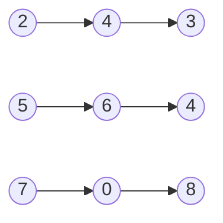

# Add Two Numbers

**Link to Problem**: https://leetcode.com/problems/add-two-numbers

## Description

You are given two non-empty linked lists representing two non-negative integers. The digits are stored in reverse order, and each of their nodes contains a single digit. Add the two numbers and return the sum as a linked list.

You may assume the two numbers do not contain any leading zero, except the number 0 itself.

## Examples

### Example 1



```
Input: l1 = [2,4,3], l2 = [5,6,4]
Output: [7,0,8]
Explanation: 342 + 465 = 807.
```

### Example 2

```
Input: l1 = [0], l2 = [0]
Output: [0]
```

### Example 3

```
Input: l1 = [9,9,9,9,9,9,9], l2 = [9,9,9,9]
Output: [8,9,9,9,0,0,0,1]
```

## Thoughts

This is my first medium problem and I got wrecked immediately. I pretty much had to look up the solution because I have not done linked list and recursion in a very long time.
I was just lost and didn't have a clue about how to get started on this problem.

At the very least, I will try to explain the solution in my own words, so I can redeem myself somewhat.

So the problem is asking to essentially just add two numbers and produce the sum as the output. That's it.

The complicated part is that the problem is asking us to do it through a Linked List. Fortunately, the way the problem is laid out hints the way that it should be done.

The way the algorithm is done is by imitating how addition is done on paper which would look like this:

```
  1 <--- carry
  342
+ 465
-----
  807
```

The input stated in Example 1 is a linked list whose that starts from the right-most digit which is similar to how you would perform addition on paper.

The problem also provides a `ListNode` struct which would mean the input from Example 1 will look like this:

```
l1 = %ListNode{
  val: 2,
  next: %ListNode{
    val: 4,
    next: %ListNode{
      val: 3,
      next: nil
    }
  }
}

l2 = %ListNode{
  val: 5,
  next: %ListNode{
    val: 6,
    next: %ListNode{
      val: 4,
      next: nil
    }
  }
}
```

Again, in order to perform the addition, we need to keep in mind how the computation is done on paper.

For Example 1, we will start with the the outer-most element in the linked list which is `2` and `5` respectively.
What we need to do in code exactly is to get the sum of both numbers, divide the sum by `10`, and see if there are any remainder values.
For Elixir, this would be [`Kernel.rem/2`](https://hexdocs.pm/elixir/1.15.7/Kernel.html#rem/2).

Since the problem states that our output must be a linked list as well, we will assign the value that was computed in the previous section as the `val` attribute
of the `ListNode` struct. For the next attribute, we will have to create a new `ListNode` which suggests that we have to do the whole thing recursively.

Therefore, we have to create functions that can match with the following patterns:

```elixir
add_two_numbers(l1, l2, carry)
add_two_numbers(l1, nil, carry)
add_two_numbers(nil, l2, carry)
add_two_numbers(nil, nil, 1)
add_two_numbers(nil, nil, 0)
```

The first pattern is where we should default to when making the calculations. We assume that there is a value for `l1` and `l2`, we perform addition accordingly,
and we determine the next value by passing on the next element in the list and computing if there should be a carry or not.

```elixir
def add_two_numbers(l1, l2, carry) do
  sum = l1.value + l2.value

  %ListNode{
    val: rem(sum, 10),
    next: add_two_numbers(l1.next, l2.next, sum / 10)
  }
end
```

For the second and third pattern, what it would look like on paper is if both values don't have the same number of digits like this:

```
   1 <--- carry
  1342
+  465
------
  1807
```

```
   1 <--- carry
   342
+ 1465
------
  1807
```

The second and third pattern are need to take into account both of these scenarios.

For the fourth pattern, this is used when there are no more digits left to add, but there is a carry from the previous addition.
On paper it would look like this:

```
  1 <-- carry
   523
+  514
-----
  1037
```

The fifth and last pattern is just there for when we have finished adding all of the digits and there is nothing left to do, so we will return `nil`.
