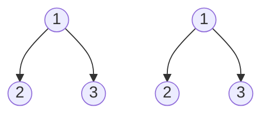
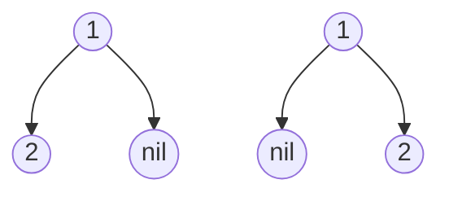

# Same Tree

**Link to Problem**: https://leetcode.com/problems/same-tree

## Description

Given the roots of two binary trees `p` and `q`, write a function to check if they are the same or not.

Two binary trees are considered the same if they are structurally identical, and the nodes have the same value.

## Examples

### Example 1



```
Input: p = [1,2,3], q = [1,2,3]
Output: true
```

### Example 2



```
Input: p = [1,2], q = [1,null,2]
Output: false
```

### Example 3


```
Input: p = [1,2,1], q = [1,1,2]
Output: false
```

## Thoughts

As always, when it comes to trees in Elixir, we should always do a recursive DFS from the bottom-up.

It should be pretty simple. We check if the current node of `p` and `q` have the same value.
If they are, we do a recursive call to compare the values of both left node and right node.

There is actually another solution in Elixir which is just `p == q` which works. Apparently, it's
because of Elixir's immutability and that the `==` compares the whole data structure.

Of course, I think it would be silly to answer this problem that way because it might look
like cheating during a coding interview.
