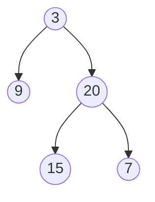

# Maximum Depth of Binary Tree

**Link to Problem**: https://leetcode.com/problems/maximum-depth-of-binary-tree

## Description

Given the `root` of a binary tree, return *its maximum depth*.

A binary tree's **maximum depth** is the number of nodes along the longest path from the root node down to the farthest leaf node.

## Examples

### Example 1



```
Input: root = [3,9,20,null,null,15,7]
Output: 3
```

## Example 2

```
Input: root = [1,null,2]
Output: 2
```

## Thoughts

I feel defeated by this problem. While I understand the algorithm, I wouldn't have figured out how to write the solution
in Elixir on my own.

I guess it makes sense because even though I'm starting to get the hang of recursion, the way I've used recursion so far
is to return the node itself and not a regular value. This meant that I'm used to writing the functions where
the argument is usually just itself.

Hopefully I get the hang of this in the future.
