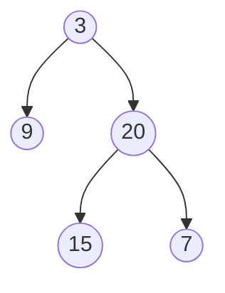
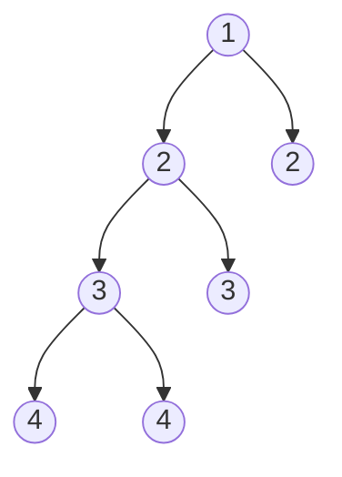

# Balanced Binary Tree

**Link to Problem**: https://leetcode.com/problems/balanced-binary-tree

## Description

Given a binary tree, determine if it is height-balanced.

A height-balanced binary tree is a binary tree in which the depth of the two subtrees of every node never differs by more than one.

## Examples

### Example 1



```
Input: root = [3,9,20,null,null,15,7]
Output: true
```

## Example 2



```
Input: root = [1,2,2,3,3,null,null,4,4]
Output: false
```

## Example 3

```
Input: root = []
Output: true
```

## Thoughts

I'm beginning to hate trees and recursion. I'm still struggling with these things even though
I understand how the algorithm should work. For some reason, I have a hard time translating
that understanding into code.
