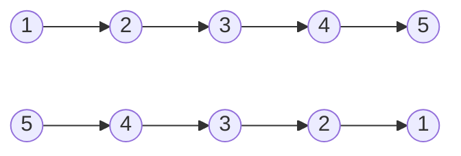
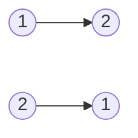

# Reverse Linked List

**Link to Problem**: https://leetcode.com/problems/reverse-linked-list

## Description

Given the `head` of a singly linked list, reverse the list, and return the reversed list.

## Examples

### Example 1



```
Input: head = [1,2,3,4,5]
Output: [5,4,3,2,1]
```

### Example 2



```
Input: head = [1,2]
Output: [2,1]
```

### Example 3

```
Input: head = []
Output: []
```

## Thoughts

For this problem, my first thought was to do a similar solution to [2 - Add Two Numbers](../00002_add_two_numbers) and I proceeded to attempt to write a solution.

Unfortunately, I didn't actually know how the algorithm should work on paper so I failed spectacularly.

Naturally, I watched NeetCode's explanation of the solution for this problem, so I will now proceed to
explain the solution in my own words.

First of all, the way to solve this problem is to go through each node and switch it with the next one.
The end result will be a linked list that is opposite from the original one that came in.

Technically, there are 2 ways to solve this problem.

### Solution 1 - Two Pointers

The first way is to use two pointers to perform the switch. So you do a loop, create a temporary variable,
store the current node to this temporary variable, change the value of the current node to the next node,
change the value of the next node into the node stored in the temporary variable which is the current node.
Afterwards, you continue the loop.

NeetCode said that this solution is the most optimal because apparently, the space complexity is only `O(1)`
and this is due to the fact that there are only pointers involved and new data structures have been made.

### Solution 2 - Recursion

Instead of a loop, you perform recursion to traverse through the linked list. Space complexity is `O(n)`
according NeetCode, but he didn't mention why exactly. I'm guessing it's because a new data structure
is being produced out of the recursion.

### What I went with

Unfortunately, I didn't really have much choice in this subject because Solution 1 is just impossible if
you're using a functional programming language.

The reason is because Solution 1 involves the typical OOP approach of defining a variable at the outside
of a loop and then proceeding to change its value while you're inside the loop.

Variables in functional programming are final and cannot be mutated, so this approach simply isn't an option.

Fortunately, the solution actually looks really simple if done through recursion.
