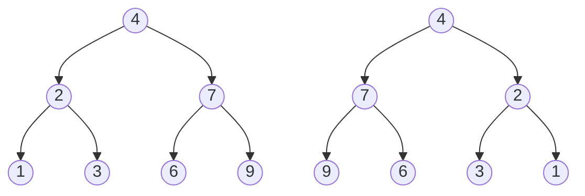
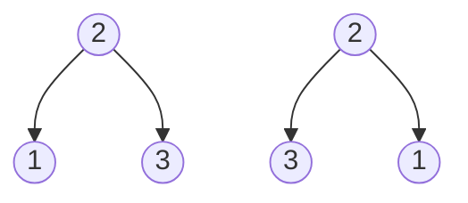

# Invert Binary Tree

**Link to Problem**: https://leetcode.com/problems/invert-binary-tree

## Description

Given the `root` of a binary tree, invert the tree, and return *its* root.

## Examples

### Example 1



```
Input: root = [4,2,7,1,3,6,9]
Output: [4,7,2,9,6,3,1]
```

### Example 2



```
Input: root = [2,1,3]
Output: [2,3,1]
```

### Example 3

```
Input: root = []
Output: []
```

## Thoughts

Elixir just continues to be a really good language to use because of how simple the code
turned out to be.

Apparently, the algorithm is called DFS or Depth-first Search according to NeetCode, but
looking at the way the example was drawn made it obvious about how to handle the inversion.
