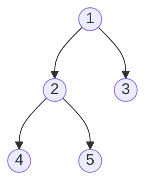

# Diameter of Binary Tree

**Link to Problem**: https://leetcode.com/problems/diameter-of-binary-tree

## Description

Given the `root` of a binary tree, return the length of the **diameter** of the tree.

The **diameter** of a binary tree is the **length** of the longest path between any two nodes in a tree. This path may or may not pass through the `root`.

The **length** of a path between two nodes is represented by the number of edges between them.

## Examples

### Example 1



```
Input: root = [1,2,3,4,5]
Output: 3
Explanation: 3 is the length of the path [4,2,1,3] or [5,2,1,3].
```

### Example 2

```
Input: root = [1,2]
Output: 1
```

## Thoughts

For this problem, I knew I would be able to use the things I learned from [104 - Maximum Depth of Binary Tree](../00104_maximum_depth_of_binary_tree),
so I tried doing it on my own. Unfortunately, I did not succeed because I didn't actually know what diameter means in this context.

As always, I proceeded to watch NeetCode's explanation of the problem. Apparently, a tree diameter is based on the combined height of the left
and right nodes. I thought the explanation was pretty good, but I had an issue with trying to replicate his solution in Elixir.

So the way he presented the solution was that there was supposed to be a formula to get both the height of a node along with its diameter.

This threw me off because it didn't really work for Elixir. Specifically, what didn't work was assuming that a null node is supposed to have
a height of `-1` which is why the formula accounted for this fact.

I think because Elixir is a functional language, it was fine to assume that a null node would have `0` as its height. So when I did this,
the whole thing worked.

Another difference with my solution when compared to NeetCode was the calculation on the diameter. Honestly, I still don't completely understand
why this formula works, but hopefully I will in due time.
