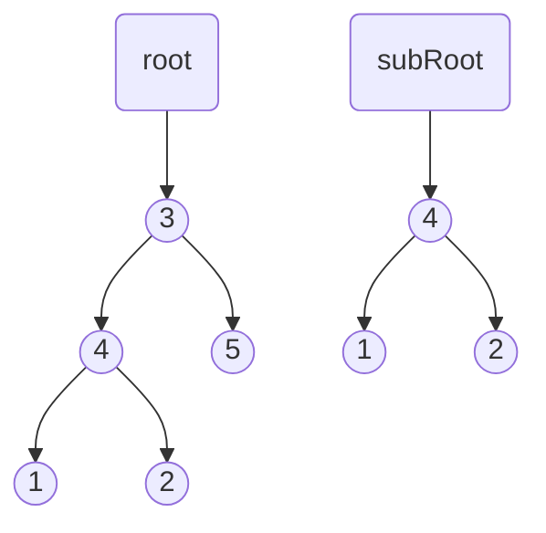
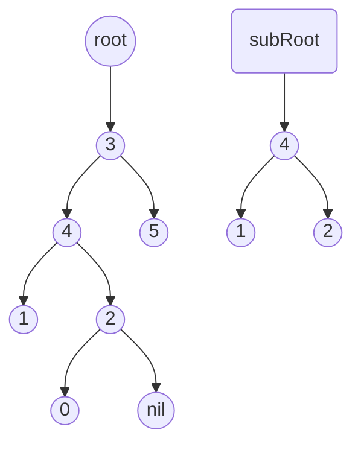

# Subtree of Another Tree

**Link to Problem**: https://leetcode.com/problems/subtree-of-another-tree

## Description

Given the roots of two binary trees `root` and `subRoot`, return `true` if there is a subtree of
root with the same structure and node values of `subRoot` and `false` otherwise.

A subtree of a binary tree `tree` is a tree that consists of a node in `tree` and all of this
node's descendants. The tree `tree` could also be considered as a subtree of itself.

## Examples

### Example 1



```
Input: root = [3,4,5,1,2], subRoot = [4,1,2]
Output: true
```

### Example 2



```
Input: root = [3,4,5,1,2,null,null,null,null,0], subRoot = [4,1,2]
Output: false
```

## Thoughts

Part of the solution for this comes from [100 - Same Tree](../00100_same_tree), so I just reused that.

The thing that I struggled with in this problem was figuring out how to end the recursion and keep it going.

It's actually just really simple, but getting to that solution was not something that just came to me naturally.
